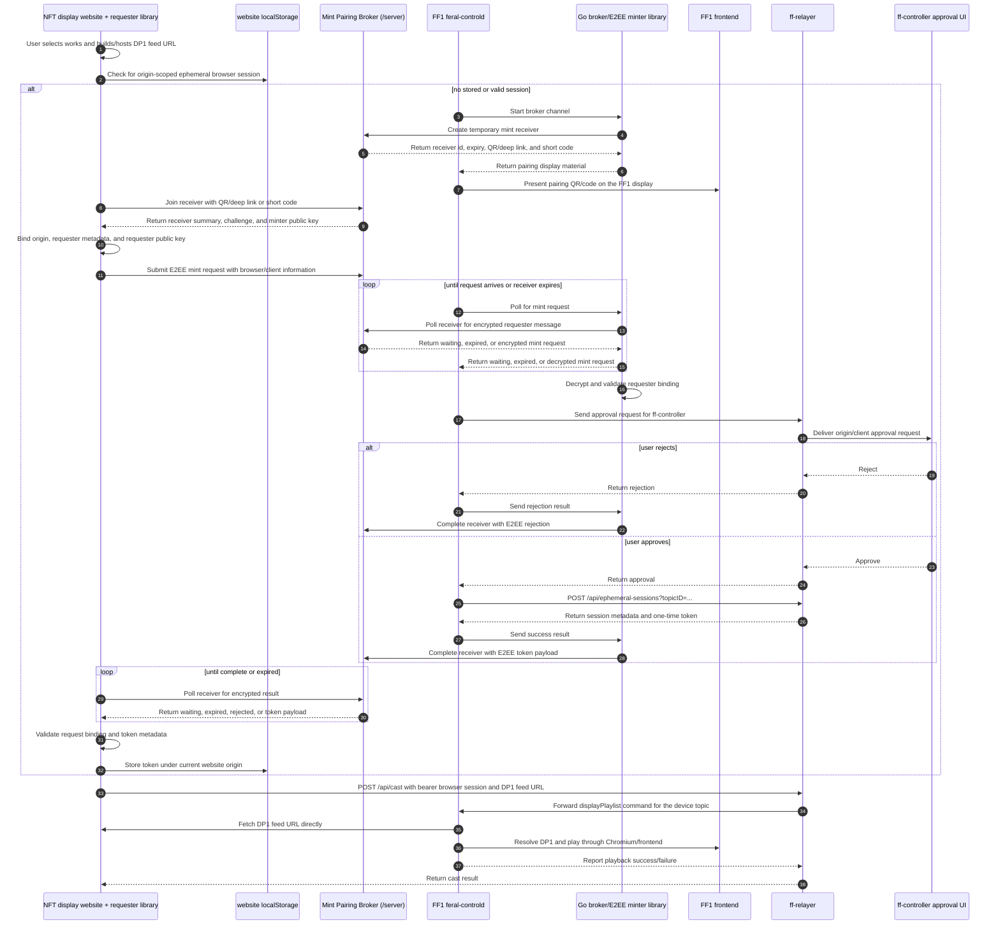

# Sequential Flow

This target design uses five active parties and one short-lived transport
component:

- NFT display website: the website where the user selects works, exposes a DP1
  feed URL for playback, and runs the token requester browser library. The
  current requester implementation is the TypeScript browser library in
  `clients/session-recipient/js/`.
- FF1 / `feral-controld`: the device backend that owns the topic authority
  needed to mint browser sessions. It embeds the Go minter library for Mint
  Pairing Broker communication and end-to-end encryption, asks `ff-controller`
  for approval through `ff-relayer`, creates sessions through `ff-relayer`, and
  passes the final success or rejection payload back to the Go library for
  encrypted broker delivery.
- FF1 frontend: the device web UI displayed on the FF1. It presents the
  QR/deep-link payload or short code produced by `feral-controld`.
- `ff-controller`: the user approval surface. It may be the mobile app, CLI, or
  another controller UI reached by `feral-controld` through `ff-relayer`. It
  approves or rejects; it does not mint or receive browser session tokens.
- `ff-relayer`: the relay service that mints, lists, revokes, expires, and
  authorizes ephemeral browser sessions for the cast/display path.

The transport component formerly called the handoff server is now better named
the **Mint Pairing Broker**. The code still lives in `server/`. Its role is to
hold a temporary receiver, QR/deep-link payload, short code, and opaque
end-to-end encrypted request/response messages while the NFT display website and
token minter pair. The broker does not interpret mint requests, tokens, or DP1
playlist content.

The browser session is scoped to browser cast/display access. DP1 playlist
content must stay out of `ff-controller`, the Go token minter, and the Mint
Pairing Broker. The browser casts a DP1 feed URL to `ff-relayer`, and the FF1
display path fetches the feed directly.

## Sequence

## Responsibilities

### NFT Display Website

The NFT display website lets the user select works, builds or hosts the DP1 feed
URL, and runs the token requester browser library. It first checks
`localStorage` for an existing ephemeral browser session scoped to the current
website origin. If one is missing or invalid, it joins a temporary mint receiver
through the Mint Pairing Broker using a QR/deep-link payload or short code,
establishes an end-to-end encrypted channel with the token minter, submits a
mint request containing origin and browser/client metadata, receives the
encrypted token result, stores the token in origin-scoped storage, and attaches
it only to the intended `ff-relayer` cast/display request. It does not receive
API keys or topic-management authority.

### Ephemeral Token Minter

The ephemeral token minter is the planned Go library used by FF1
`feral-controld` for broker communication and end-to-end encryption. It starts
temporary mint receivers, returns QR/deep-link and short-code pairing material
to `feral-controld` for FF1 frontend display, decrypts requester mint requests,
validates requester binding, and sends encrypted success or rejection payloads
back through the broker.

The Go library does not contact `ff-controller` or `ff-relayer` and does not
own session creation policy. `feral-controld` receives the decrypted
`MintRequest`, asks the user for approval through its controller/relayer path,
calls `ff-relayer` to create an ephemeral browser session on approval, then
passes either `MintResult` or `MintRejection` into the Go library for encrypted
delivery to the requester.

### ff-controller

`ff-controller` is now the approval UI rather than the token minter.
`feral-controld` contacts it through `ff-relayer` with a request summary,
selected FF1/device topic, origin, client information, and challenge details.
The controller returns approve or reject through `ff-relayer`. It must not
receive, copy, or proxy raw browser session tokens or DP1 playlist content.

### ff-relayer

`ff-relayer` owns the ephemeral session lifecycle used for display requests:
create, list, revoke, expire, and authorize browser casts. Per
`feral-file/ff-relayer#13`, `feral-controld` creates sessions with
`POST /api/ephemeral-sessions?topicID=...`, management clients can list and
revoke with `GET /api/ephemeral-sessions?topicID=...` and
`DELETE /api/ephemeral-sessions/{sessionID}?topicID=...`, and browsers cast with
`Authorization: Bearer <session-token>` or
`EPHEMERAL-SESSION: <session-token>`. Browser session tokens are accepted only
for the allowed cast/display path and do not grant broader API-key access.

### Mint Pairing Broker

The Mint Pairing Broker is a narrow bridge between token requesters and token
minters. It stores receiver records and opaque encrypted messages in durable bbolt
state, backed by the Docker volume in deployed environments, for a short pairing
window. The broker does not interpret whether a message is a mint request, an
approval result, a token payload, or any other content because request and
response messages are end-to-end encrypted between the requester and minter.

The broker enforces strict request and payload limits to bound abuse and storage
growth. The current encrypted payload limit is 64 KiB, which is intentionally
larger than expected token-mint metadata while still small enough for short-lived
bbolt storage and HTTP polling.

### FF1 / feral-controld and Frontend

`feral-controld` is the FF1 backend and embeds the Go broker/E2EE minter
library. The FF1 frontend is a website displayed on the device and presents the
pairing QR/deep-link or short code returned by that library. `feral-controld`
owns approval orchestration, `ff-relayer` session creation, and topic authority.
The FF1 display path receives the relayer cast command after the browser
presents a valid ephemeral session, fetches the DP1 feed URL directly, resolves
DP1 content, and plays it through Chromium/frontend. The device path, not
`ff-controller`, fetches playlist content.

## Security Notes

- Ephemeral browser session tokens are bearer credentials and must not be logged.
- Tokens stored by the browser library are scoped by browser origin through `localStorage`.
- Mint request and token response payloads are opaque to the Mint Pairing Broker and are retained only for the short pairing window.
- `feral-controld` obtains raw token material from `ff-relayer` and passes it to the Go minter library only for E2EE requester delivery.
- Revocation and expiry are enforced by `ff-relayer`.
- `ff-controller` approves or rejects requests but does not receive raw tokens or DP1 playlist content.
- DP1 feed URLs travel through the browser cast request; DP1 playlist content is fetched directly by the FF1 display path.
- Session-management actions remain controlled by `feral-controld` or another API-key-authorized party outside the Go broker/E2EE library.
