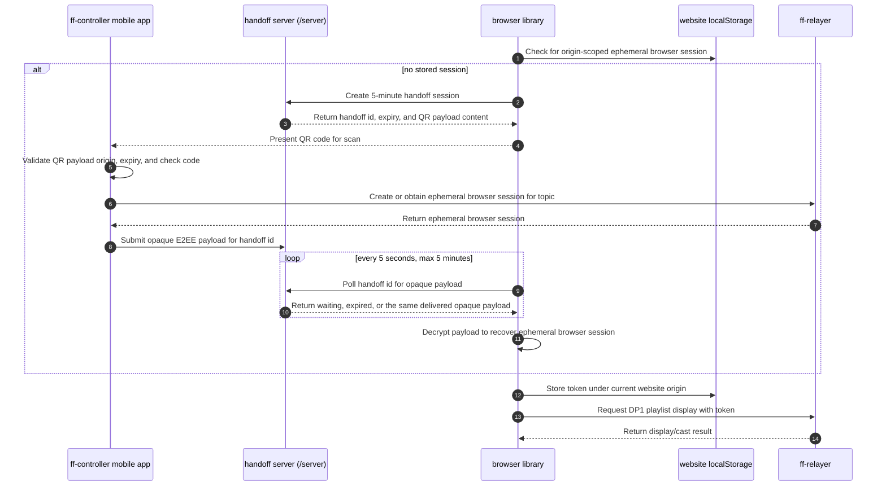

# Sequential Flow

This project uses three parties and one transport component:

- `ff-controller`: the mobile app that has user authority to create or obtain an ephemeral browser session for a relay topic.
- Browser library: code running on a website in the user's browser. It checks that website origin's `localStorage` for an existing ephemeral browser session. When none exists, it opens a short-lived handoff with the handoff server and returns QR-code content for the mobile app to scan.
- `ff-relayer`: the relay service that accepts ephemeral browser session authentication for DP1 playlist display requests.

The handoff server in `server/` is the transport component that carries opaque end-to-end encrypted handoff content from `ff-controller` to the browser without moving playlist content through the mobile app.

The browser session is scoped to browser cast/display access. The DP1 playlist stays in the browser request path to `ff-relayer`; it must not be routed through `ff-controller`.

## Sequence

## Responsibilities

### ff-controller

`ff-controller` is responsible for scanning and validating the QR payload, creating or obtaining the user-authorized ephemeral browser session from `ff-relayer`, session revocation UI, and sending the encrypted handoff payload to the handoff server. It must not receive, copy, or proxy the DP1 playlist that the browser later asks `ff-relayer` to display.

### Browser Library

The browser library first checks `localStorage` for an existing ephemeral browser session scoped to the current website origin. If one is missing, it creates a handoff session, returns QR-code content to the website UI, polls the handoff server every 5 seconds for up to 5 minutes, decrypts the delivered payload, stores the recovered browser session in `localStorage`, and attaches it to `ff-relayer` display requests. Because browser storage is origin-scoped, each website gets its own local token state.

### ff-relayer

`ff-relayer` owns the ephemeral session lifecycle used for display requests: create, list, revoke, expire, and authorize browser casts. Browser session tokens are accepted only for the allowed cast/display path and do not grant broader API-key access.

### Handoff Server

The handoff server is a narrow bridge between `ff-controller` and the browser library. It stores handoff records in durable LMDB state, backed by the Docker volume in deployed environments, for at most 5 minutes. The server does not interpret whether the payload is an ephemeral browser session or any other content because the payload is end-to-end encrypted between the mobile app and the browser. While the handoff record remains valid, every browser poll returns the same delivered payload; expiry and cleanup remove access after the window closes.

The server enforces a strict payload limit to bound abuse and storage growth. The current encrypted payload limit is 64 KiB, which is intentionally larger than the expected ephemeral browser session metadata while still small enough for short-lived LMDB storage and HTTP polling.

## Security Notes

- Ephemeral browser session tokens are bearer credentials and must not be logged.
- Tokens stored by the browser library are scoped by browser origin through `localStorage`.
- Handoff payloads are opaque to the handoff server and are retained only for the short handoff window.
- Revocation and expiry are enforced by `ff-relayer`.
- DP1 playlist data travels from the browser library to `ff-relayer`, not through `ff-controller`.
- Session-management actions remain controlled by `ff-controller` or another API-key-authorized party.
