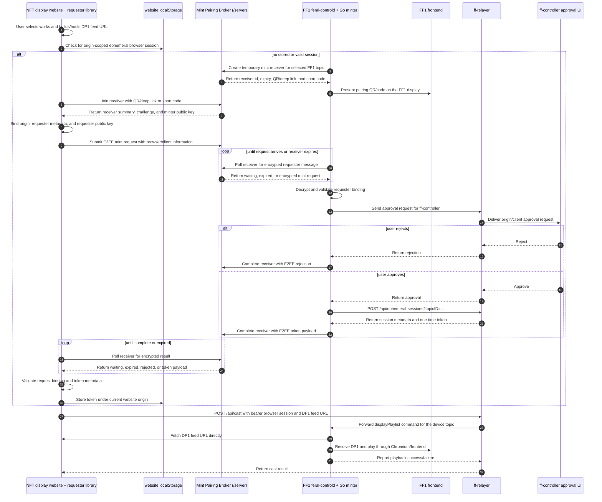

# Sequential Flow

This target design uses five active parties and one short-lived transport
component:

- NFT display website: the website where the user selects works, exposes a DP1
  feed URL for playback, and runs the token requester browser library. The
  current requester implementation is the TypeScript browser library in
  `clients/session-recipient/js/`.
- FF1 / `feral-controld`: the device backend that embeds the planned Go
  ephemeral token minter library. It owns the topic authority needed to mint
  browser sessions, starts temporary mint receivers, asks `ff-controller` for
  approval through `ff-relayer`, and transfers minted token information back to
  the requester over end-to-end encryption.
- FF1 frontend: the device web UI displayed on the FF1. It presents the
  QR/deep-link payload or short code produced by `feral-controld`.
- `ff-controller`: the user approval surface. It may be the mobile app, CLI, or
  another controller UI reached by `feral-controld` through `ff-relayer`. It
  approves or rejects; it does not mint or receive browser session tokens.
- `ff-relayer`: the relay service that mints, lists, revokes, expires, and
  authorizes ephemeral browser sessions for the cast/display path.

The transport component formerly called the handoff server is now better named
the **Mint Pairing Broker**. The code still lives in `server/`. Its role is to
hold a temporary receiver, QR/deep-link payload, short code, and opaque
end-to-end encrypted request/response messages while the NFT display website and
token minter pair. The broker does not interpret mint requests, tokens, or DP1
playlist content.

The browser session is scoped to browser cast/display access. DP1 playlist
content must stay out of `ff-controller`, the Go token minter, and the Mint
Pairing Broker. The browser casts a DP1 feed URL to `ff-relayer`, and the FF1
display path fetches the feed directly.

## Sequence



## Responsibilities

### NFT Display Website

The NFT display website lets the user select works, builds or hosts the DP1 feed
URL, and runs the token requester browser library. It first checks
`localStorage` for an existing ephemeral browser session scoped to the current
website origin. If one is missing or invalid, it joins a temporary mint receiver
through the Mint Pairing Broker using a QR/deep-link payload or short code,
establishes an end-to-end encrypted channel with the token minter, submits a
mint request containing origin and browser/client metadata, receives the
encrypted token result, stores the token in origin-scoped storage, and attaches
it only to the intended `ff-relayer` cast/display request. It does not receive
API keys or topic-management authority.

### Ephemeral Token Minter

The ephemeral token minter is the planned Go library used by FF1
`feral-controld`, replacing the Flutter `ff-controller` client library as the
token-minting component. It starts temporary mint receivers, returns
QR/deep-link and short-code pairing material to the FF1 frontend for display,
decrypts requester mint requests, asks the user for approval through
`ff-controller` over `ff-relayer`, and, on approval, calls `ff-relayer` to create
the ephemeral browser session:

```http
POST /api/ephemeral-sessions?topicID=<topic>
```

The request is API-key or topic-authorized and can include bounded metadata such
as `label`, `browserName`, `browserUserAgent`, and `expiresInSeconds`. The
response includes session metadata and a one-time-visible bearer token. The
minter sends that token to the requester only inside the end-to-end encrypted
broker response and must not log it.

### ff-controller

`ff-controller` is now the approval UI rather than the token minter. The token
minter contacts it through `ff-relayer` with a request summary, selected
FF1/device topic, origin, client information, and challenge details. The
controller returns approve or reject through `ff-relayer`. It must not receive,
copy, or proxy raw browser session tokens or DP1 playlist content.

### ff-relayer

`ff-relayer` owns the ephemeral session lifecycle used for display requests:
create, list, revoke, expire, and authorize browser casts. Per
`feral-file/ff-relayer#13`, the minter creates sessions with
`POST /api/ephemeral-sessions?topicID=...`, management clients can list and
revoke with `GET /api/ephemeral-sessions?topicID=...` and
`DELETE /api/ephemeral-sessions/{sessionID}?topicID=...`, and browsers cast with
`Authorization: Bearer <session-token>` or
`EPHEMERAL-SESSION: <session-token>`. Browser session tokens are accepted only
for the allowed cast/display path and do not grant broader API-key access.

### Mint Pairing Broker

The Mint Pairing Broker is a narrow bridge between token requesters and token
minters. It stores receiver records and opaque encrypted messages in durable LMDB
state, backed by the Docker volume in deployed environments, for a short pairing
window. The broker does not interpret whether a message is a mint request, an
approval result, a token payload, or any other content because request and
response messages are end-to-end encrypted between the requester and minter.

The broker enforces strict request and payload limits to bound abuse and storage
growth. The current encrypted payload limit is 64 KiB, which is intentionally
larger than expected token-mint metadata while still small enough for short-lived
LMDB storage and HTTP polling.

### FF1 / feral-controld and Frontend

`feral-controld` is the FF1 backend and embeds the Go ephemeral token minter
library. The FF1 frontend is a website displayed on the device and presents the
pairing QR/deep-link or short code created by the minter. The FF1 display path is
the device-rooted authority behind the topic: it receives the relayer cast
command after the browser presents a valid ephemeral session, fetches the DP1
feed URL directly, resolves DP1 content, and plays it through Chromium/frontend.
The device path, not `ff-controller`, fetches playlist content.

## Security Notes

- Ephemeral browser session tokens are bearer credentials and must not be logged.
- Tokens stored by the browser library are scoped by browser origin through `localStorage`.
- Mint request and token response payloads are opaque to the Mint Pairing Broker and are retained only for the short pairing window.
- The token minter sends raw token material only over the E2EE requester channel.
- Revocation and expiry are enforced by `ff-relayer`.
- `ff-controller` approves or rejects requests but does not receive raw tokens or DP1 playlist content.
- DP1 feed URLs travel through the browser cast request; DP1 playlist content is fetched directly by the FF1 display path.
- Session-management actions remain controlled by the token minter or another API-key-authorized party.
